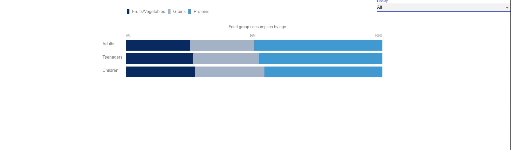
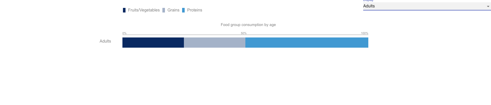
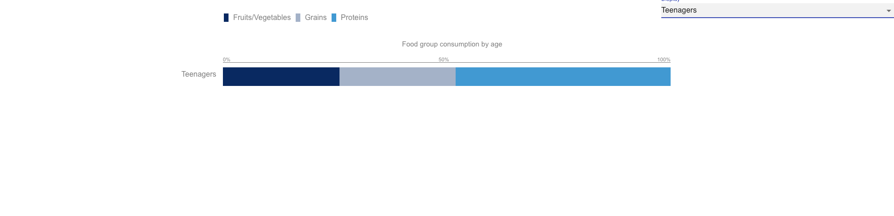
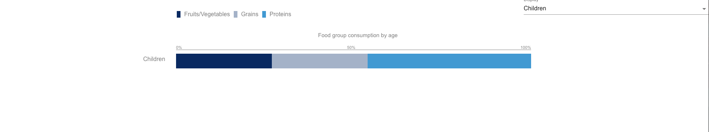

# Coding Challenge 

## Description

> Welcome to the Demo Coding Challenge. I was tasked with creating a graph that represented the consumption of Food by different age groups. There are multiple ways to do this, this was just the way I felt the most comfortable doing it.


[Live Link](https://lovely-strudel-8a044e.netlify.app/)


## Screen shots
#### HomePage


#### Adults


#### Teenagers


#### Children


## Installation Instructions
* Fork this repository
* Clone it down to your local machine
* Open in a code editor
* Run an ```npm i```
* Then run ```npm start``` in order to start the application


## Minimun Viable Product
* Demonstrating the Ability to create a demographic while only using Data
* Showing the differences between each age group
* Demonstrating the different types of food consumption between age groups

## User Stories
- As a User I want to see the consumption of foods between Adults and Teens
- As a User I want to see the consumption of foods between Teens and Children
- As a User I want to see the consumption of foods between Adults and Children


## Technologies Used
* React
* HTML
* CSS
* Material-UI
* Styled Components

